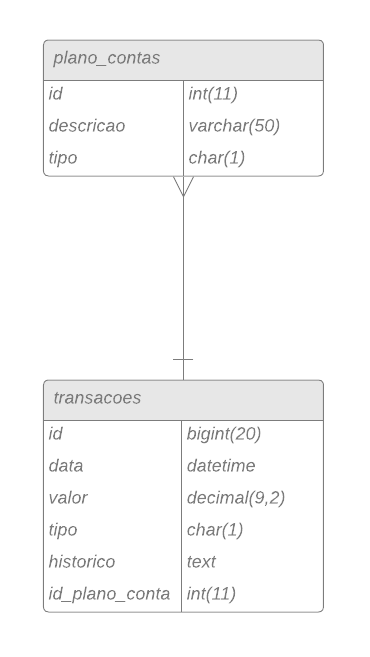

# myfinance-web-dotnet
- [myfinance-web-dotnet](#myfinance-web-dotnet)
	- [Sobre](#sobre)
	- [Script Database](#script-database)
	- [Como conectar ao banco de dados](#como-conectar-ao-banco-de-dados)

## Sobre
MyFinance - Projeto do Curso de Pós-Graduação em Engenharia de Software da PUC-MG

Nesse projeto será utilizada a stack dotnet e, inicialmente, MariaDB mas foi alterado para SQLServer.
O script pra a criação das entidades se encontra na sessão [Script Database](#script-database) na versão de MariaDB

## Script Database
create table plano_contas(
	id int not null auto_increment,
	descricao varchar(50) not null,
	tipo char(1) not null,
	primary key(id)
);

create table transacao(
	id bigint  not null auto_increment,
	data datetime not null,
	valor decimal(9,2) not null,
	tipo char(1) not null,
	historico text null,
	id_plano_conta  int not null,
	primary key(id),
	foreign key(id_plano_conta) references plano_contas(id)
);

## Como conectar ao banco de dados

Para utilizar a aplicação em ambiente local, é necessário seguir os seguintes passos:
1- Criar o banco de dados no SQLServer;

2- Alterar em myfinance-web-dotnet/appsettings.json a ConnectionString onde server é o endereço do banco de dados e Database o nome do banco de dados;